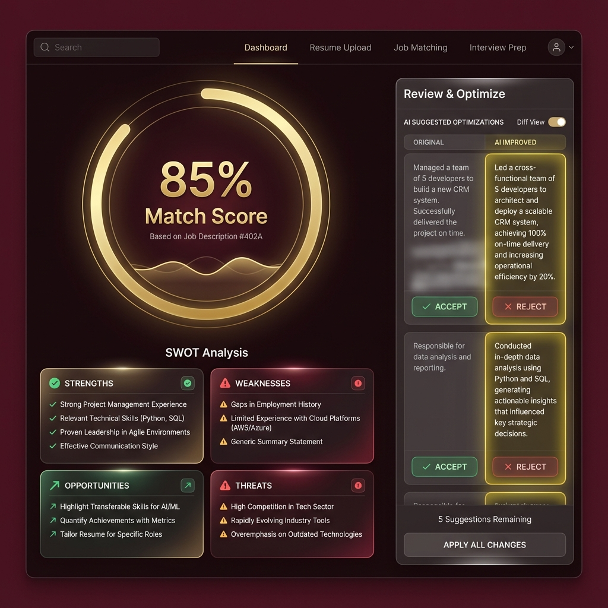
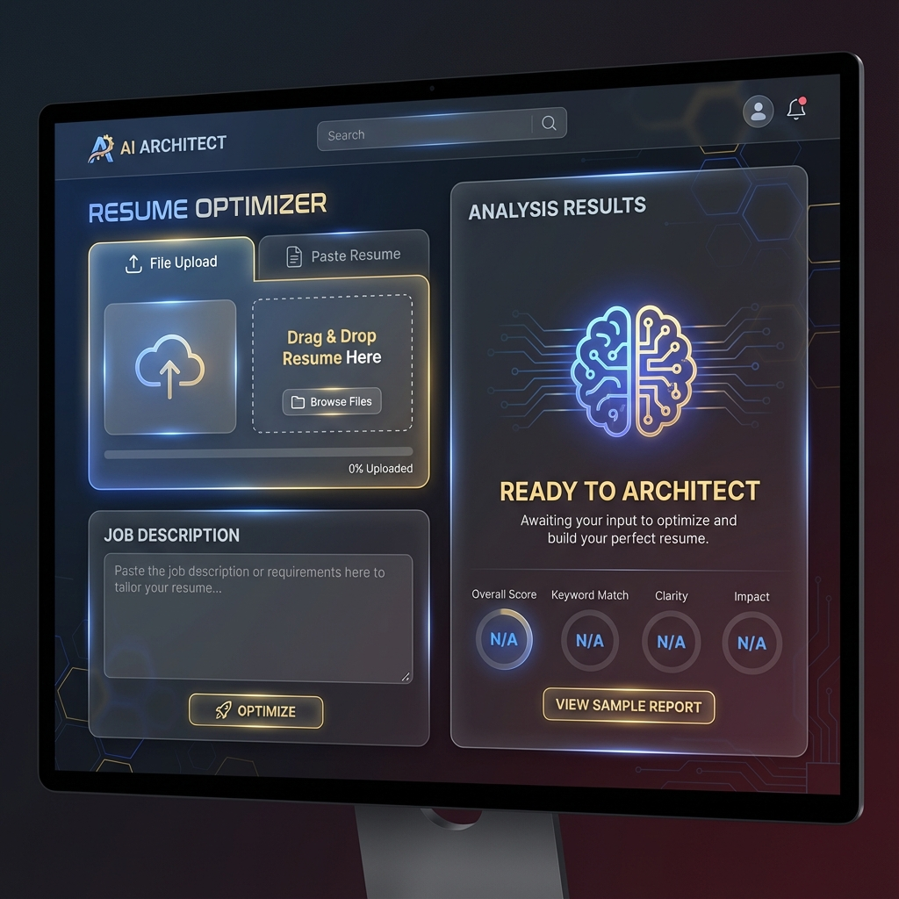
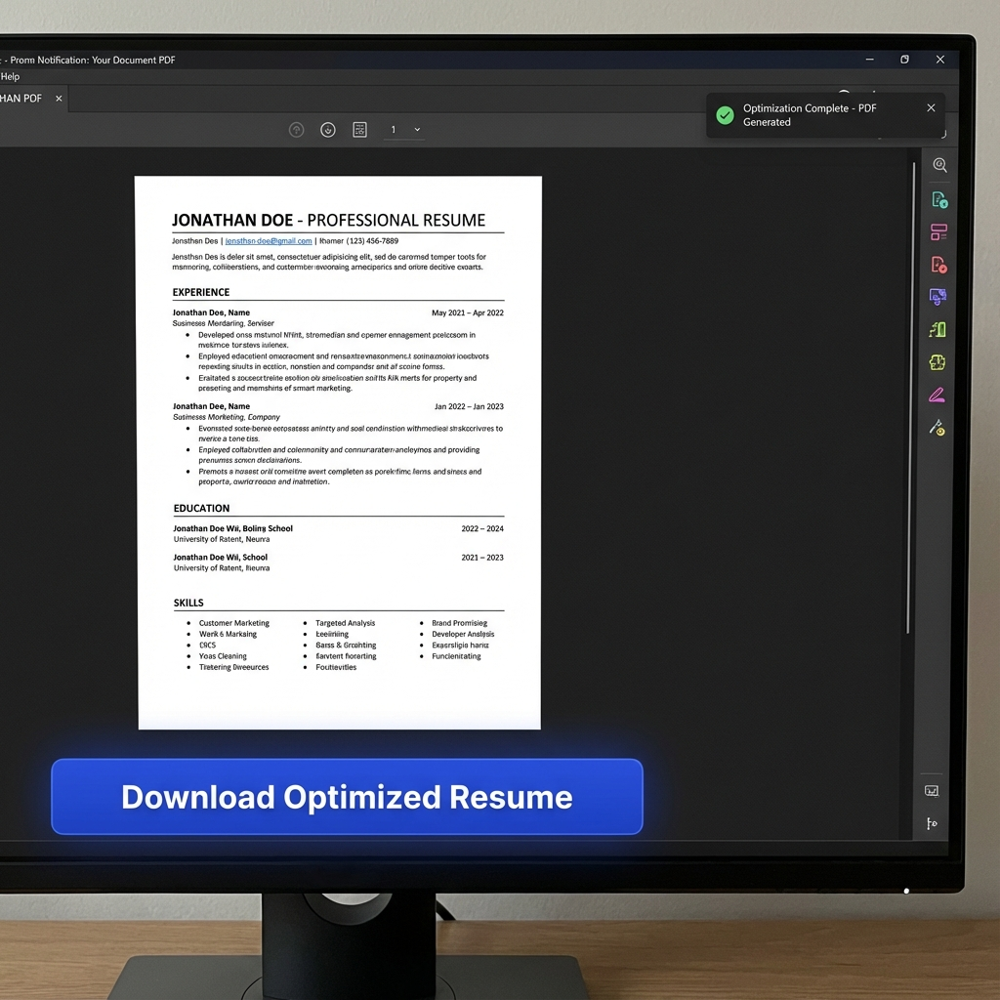

# VitaeVantage 



## Overview
**VitaeVantage** is a powerful AI-driven application designed to optimize your resume for specific job descriptions (JDs). By leveraging advanced Large Language Models (LLMs), it analyzes your resume against a target JD, provides a SWOT analysis, and intelligently rewrites content to maximize ATS (Applicant Tracking System) compatibility and impact.

## ✨ Key Features
- **Smart Resume Parsing**: Support for PDF and DOCX uploads, or direct text paste.
- **JD Matching**: Upload or paste Job Descriptions to get a tailored compatibility score.
- **SWOT Analysis**: Breakdown of your resume's Strengths, Weaknesses, Opportunities, and Threats relative to the role.
- **AI Optimization**: Granular "Diff View" showing original vs. optimized text with "Accept/Reject" logic.
- **PDF Generation**: Download a fully re-created, optimized PDF resume with your accepted changes applied.
- **Dark Mode UI**: A premium, glassmorphism-inspired interface designed for focus.



## 🛠️ Tech Stack

### Frontend
- **React (Vite)**: Fast, modern UI framework.
- **Tailwind CSS**: Utility-first styling with a custom "Maroon & Gold" premium theme.
- **Framer Motion**: Smooth animations and transitions.
- **Supabase JS**: Real-time database and authentication integration.
- **Lucide React**: Clean, consistent icon set.

### Backend
- **FastAPI (Python)**: High-performance async API.
- **Supabase (PostgreSQL)**: Managed database with Row Level Security (RLS).
- **Groq API (Llama 3)**: Ultra-fast LLM inference for text analysis.
- **PyMuPDF / python-docx**: Document parsing.
- **ReportLab**: Programmatic PDF generation.

---

## 🚀 Getting Started

### Prerequisites
- Node.js (v18+)
- Python (v3.10+)
- Supabase Account
- Groq API Key

### Installation

1. **Clone the Repository**
   ```bash
   git clone <repo-url>
   cd CVSWOTTER
   ```

2. **Backend Setup**
   ```bash
   cd backend
   python -m venv .venv
   .venv\Scripts\activate  # Windows
   pip install -r requirements.txt
   ```
   - Create a `.env` file in `backend/` with:
     ```
     SUPABASE_URL=your_supabase_url
     SUPABASE_KEY=your_supabase_key
     GROQ_API_KEY=your_groq_key
     ```
   - Run the Server:
     ```bash
     uvicorn app.main:app --reload
     ```

3. **Frontend Setup**
   ```bash
   cd frontend
   npm install
   ```
   - Create a `.env` file in `frontend/` with:
     ```
     VITE_SUPABASE_URL=your_supabase_url
     VITE_SUPABASE_ANON_KEY=your_supabase_key
     VITE_API_URL=http://localhost:8000/api
     ```
   - Run the Client:
     ```bash
     npm run dev
     ```

## 📖 How to Use

1. **Upload Resume**: Drag & drop your CV (PDF/DOCX) or paste the text in the "Resume" card.
2. **Add Job Description**: Upload the JD file or paste the requirements in the "Job Description" card.
3. **Analyze**: Click **"ANALYZE & OPTIMIZE"**. The AI will process the documents.
4. **Review**:
   - Check your **Match Score**.
   - Review the **SWOT Analysis**.
   - In the **Optimization Plan**, go through each suggestion. Click **Check (✓)** to accept an AI improvement or **X** to keep your original text.
5. **Download**: Click **"DOWNLOAD OPTIMIZED RESUME"** to get your new PDF with only the changes you approved.



## License
MIT
